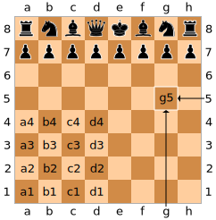

# Welcome to TypeScript Chess

<p align = "center">
    <video src="./media/TScmdChess Scholars Mate.mp4" width=350>
</p>

## Set up

### 0. Prerequisites

The recommended versions for this project are Node.js version 20.8.0 and npm (node pacakge manager) version 10.1.0. To check which versions of Node.js and npm are installed run the following commands in your terminal:
```
node --version
npm --version
```

Additionally you can use npx (included automatically in newer versions of node) to Switch to the recomended Node.js version.
```
npm install -g npx
npx node@20.8.0
```

### 1. Cloning the repository
To get started you will first need to clone the repository on to your local machine. This can be done by running `git clone` + `THIS_REPOSITORY_URL`. Open your terminal or command prompt and run the following command:

```
git clone https://github.com/Luisgarchi/TScmdChess.git
```

### 2. Install the dependencies
Once the repository has finished being cloned, navigate into the project directory as follows:

```
cd tscmdchess
```

Install the project dependencies using npm:
``` 
npm install 
```

### 3. Building the Project
Before running the app you need to compile the TypeScript code into JavaScript.
The following command will build the project into a new folder called "dist":
``` 
npm run build 
```

### 4. Start the Application

Optional: This project uses Jest for testing. You can run the tests with:
```
npm test
```
Once built, you can run the the application using the start command. This command will execute the compiled Main.js file located in the dist directory.

```
npm start
```

## How to play + UCI notation

The game is played by typing a player's move into the terminal. To do this the application uses a version of chess notation called [UCI which stands for Universal Chess Interface](https://en.wikipedia.org/wiki/Universal_Chess_Interface). UCI is a version of [long algebraic notation](https://en.wikipedia.org/wiki/Algebraic_notation_(chess)#Long_algebraic_notation) where both the starting and ending squares are specified (since the starting square is specified there is no need to include the piece before the square). Each square on the board has a unique coordinate pair consisting of a letter and a number known as files and ranks respectively. Files refer to the vertical columns of the board labeled *a* through *h* starting from the queenside of the board to the kingside. Similarly ranks refer to the vertical rows and are labeled *1* through *8* starting from the white side of the board.

<p align = "center">
    
</p>
### Castling

In order to castle using UCI notation the departure square of the king and that of arrival are used. This results in 4 castling moves in UCI notation:
1. The **white** King castling **kingside** is "**e1g1**"
2. The **black** King castling **kingside** is "**e8g8**"
3. The **white** King castling **queenside** is "**e1c1**"
3. The **black** King castling **queenside** is "**e8c8**"

The same rules for castling apply: 1. the castling King and Rook have not moved 2. the King does not leave, cross over, or finish on a square attacked by an enemy piece.

### Promotion

In this case, the notation changes to 5 characters, the letter of the piece is added at the end.

The allowed letters are: Q for Queen, B for Bishop, N for Knight, and R for Rook.

Example: e7e8q for a pawn promotion to Queen (white)

## Future work

### 1. Draw (Stalemate + 3 fold repetition)

### 2. Refactoring